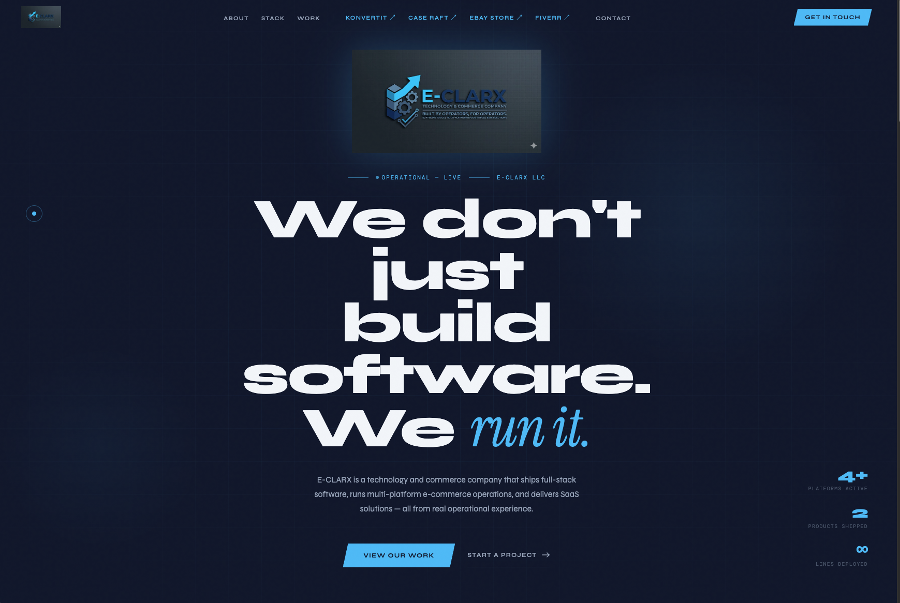

# E-CLARX LLC

**Built by Operators, for Operators.**

🌐 [e-clarx.com](https://e-clarx.com)

E-CLARX LLC is a technology and commerce company that builds software from real operational friction — not theory. From marketplace automation to full-stack SaaS tools, every product we ship solves problems we actually encountered.



## Products

### [KonvertIt](https://konvert-it.vercel.app/)
Multi-marketplace product data conversion SaaS. Upload once, export to Amazon, eBay, Walmart, and Shopify. Deployed on Vercel and Railway with live database persistence and Redis caching.

### [Case Raft](https://caseraft.com)
Clio Manage report generator for solo law firm attorneys. Connects via OAuth, pulls case and client data, and generates downloadable PDF reports in seconds. Deployed on Railway with PostgreSQL.

## Services

- **Software & SaaS Development** — Full-stack web applications built with React, Node.js, Python, and Flask
- **E-Commerce Operations** — Multi-channel selling across Amazon, Walmart, eBay, and Shopify
- **Marketplace Automation** — Product discovery, automated listing, price monitoring, and arbitrage tools

## Tech Stack

| Layer      | Technologies                          |
|------------|---------------------------------------|
| Frontend   | React, Vite, Vanilla CSS              |
| Backend    | Flask, Node.js, Express               |
| Database   | PostgreSQL, SQLite, Redis             |
| Deployment | Vercel, Railway, Docker               |
| Design     | Syne, DM Mono, Instrument Serif fonts |

## Project Structure

```
e-clarx/
├── index.html          # Single-page website (HTML + CSS + JS)
├── logo.jpg            # E-CLARX logo
├── caseraftlogo.jpg    # Case Raft product logo
├── konvertitlogo.jpg   # KonvertIt product logo
└── README.md
```

## License

Private — All rights reserved.
